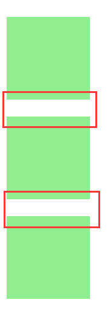

# 什么是BFC？

BFC全称是Block Formatting Context，即块格式化上下文。它是CSS2.1规范定义的，关于CSS渲染定位的一个概念。

BFC 相当于一个隔离的空间，容器内部的元素定位不受外部影响，

FC是formatting context的首字母缩写，直译过来是格式化上下文，它是页面中的一块渲染区域，有一套渲染规则，决定了其子元素如何布局，以及和其他元素之间的关系和作用。

## 怎么创建BFC

满足下列条件之一就可触发BFC

 + 根元素,或者包含了根元素的元素
 + float的值不为none
 + 设置了overflow: hidden;
 + display的值为inline-block、table-cell、table-caption
 + position的值为absolute或fixed，即元素设置了绝对定位
 

## BFC特性
1.内部的Box会在垂直方向，一个接一个地摆放。
2.Box垂直方向的距离由margin决定。属于同一个BFC的两个相邻Box的margin会发生重叠
3.每个元素的margin box的左边， 与包含块border box的左边相接触(对于从左往右的格式化，否则相反)。即使存在浮动也是如此。
4.BFC的区域不会与float box重叠。
5.BFC就是页面上的一个隔离的独立容器，容器里面的子元素不会影响到外面的元素。反之也如此。
6.计算BFC的高度时，浮动元素也参与计算

## margin 坍塌
```
// css
.son{
    margin: 20px 0;
    width: 100px;
    height: 100px;
    background: lightgreen;
}
.overflow{
    overflow: hidden;
}

// html
<div class="son "></div>
<div class="son "></div>
<div class="son "></div>
```


如上文所说，在同一个BFC中，两个相邻box的margin会发生重叠，即值较小的margin会陷进值较大的margin中


**怎么解决？(创建BFC)**

给中间的元素套一个div 给这个的div设置overflow:hidden,即创建BFC;此时相邻的元素都在不同的BFC中，所以不会发生margin坍塌 。

```
// css
.son{
    margin: 20px 0;
    width: 100px;
    height: 100px;
    background: lightgreen;
}
.overflow{
    overflow: hidden;
}

// html
<div class="son "></div>
<div class="overflow">
    <div class="son "></div>
</div>
<div class="son "></div>
```


## 高度坍塌

```
// css
.son{
    float: left;
    width: 100px;
    height: 100px;
    background: lightgreen;
}
.parent{
    width: 300px;
    padding: 15px;
    background: lightyellow;
}
.clear::after{
    content: '';
    display: block;
    height: 0;
    visibility: hidden;
    clear: both;
}
// html
<div class="parent">
    <div class="son "></div>
</div>
```
当元素设置了float浮动后，即脱离了正常的文档流，父元素自然就没有内容来撑起。就发生了高度坍塌。


**怎么解决？（清除浮动）**

```
// css
.son{
    float: left;
    width: 100px;
    height: 100px;
    background: lightgreen;
}
.parent{
    width: 300px;
    padding: 15px;
    background: lightyellow;
}
.clear::after{
    content: '';
    display: block;
    height: 0;
    visibility: hidden;
    clear: both;
}
/*
    或者
.clear {
    overflow:hidden;
}
*/
// html
<div class="parent clear">
    <div class="son "></div>
</div>
```

+ 伪元素 给父元素创建伪元素
```
    .clear::after{
        content: '';
        display: block;
        height: 0;
        visibility: hidden;
        clear: both;
    }
```
+ 创建BFC
用上文提到能触发BFC的设置来创建一个BFC。
```
    .clear{
        overflow:hidden;
    }
```
