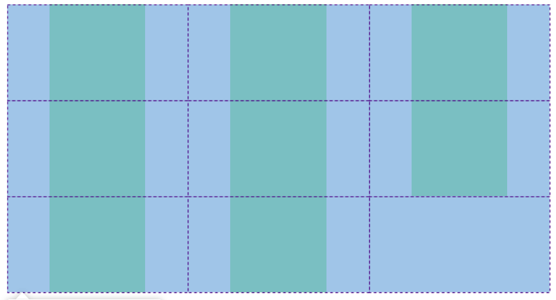
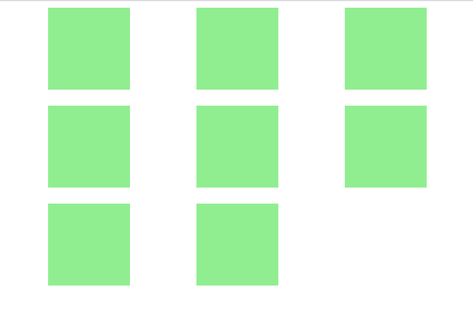

# grid布局实现网格型排版

在我们的日常开发中，可能会经常遇到这样的布局：


这就可以使用grid布局来实现，简单且实用。

```
// css
.container{
    display: grid; /* 使用grid布局 */
    grid-template-columns: 1fr 1fr 1fr; /* 这里相当于平分成了3份 */
    grid-template-rows: auto;
}
.item{
    width: 100px;
    height: 100px;
    margin: auto;
    background: lightgreen;
}
// html
<div class="container">
    <div class="item"></div>
    <div class="item"></div>
    <div class="item"></div>
    <div class="item"></div>
    <div class="item"></div>
    <div class="item"></div>
    <div class="item"></div>
    <div class="item"></div>
</div>
```
**效果:**


如果需要在每个元素直接插入空隙可以使用 grid-column-gap / grid-row-gap来设置水平 / 垂直方向的间隙

```
// css
.container{
    display: grid; /* 使用grid布局 */
    margin: 0 20px;
    grid-row-gap: 20px;
    grid-column-gap: 20px;
    grid-template-rows: auto;
    grid-template-columns: 1fr 1fr 1fr; /* 这里相当于平分成了3份 */
}
.item{
    width: 100px;
    height: 100px;
    margin: auto;
    background: lightgreen;
}
// html
<div class="container">
    <div class="item"></div>
    <div class="item"></div>
    <div class="item"></div>
    <div class="item"></div>
    <div class="item"></div>
    <div class="item"></div>
    <div class="item"></div>
    <div class="item"></div>
</div>
```

效果：


grid布局的详细用法可以看一下阮大神的[《CSS Grid 网格布局教程》](http://www.ruanyifeng.com/blog/2019/03/grid-layout-tutorial.html)