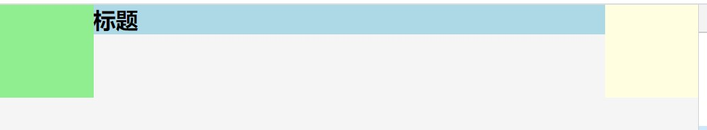

# 实现三栏布局

所谓的三栏布局就是两边固定长度 中间自适应




```
// html
 <div class="main">
    <div class="left"></div>
    <div class="right"></div>
    <div class="mid">
        <h2>标题</h2>
    </div>
</div>
```

## 绝对定位实现

```
// css
*{
    margin: 0;
    padding: 0;
}
.main{
    height: 150px;
    background: #f5f5f5;
}
.left {
    position: absolute;
    left: 0;
    width: 100px;
    height: 100px;
    background: lightgreen;
}
.right {
    position: absolute;
    right: 0;
    width: 100px;
    height: 100px;
    background: lightyellow;
}
.mid{
    margin-left: 100px; // 不加margin内容会被前面的两个div遮住一部分
    margin-right: 100px;
    background: lightblue;
}
```


## 浮动

运用浮动的方法其实跟使用绝对定位是一个意思

```
*{
    margin: 0;
    padding: 0;
}
.main{
    height: 150px;
    background: #f5f5f5;
}
.left {
    float: left;
    width: 100px;
    height: 100px;
    background: lightgreen;
}
.right {
    float: right;
    width: 100px;
    height: 100px;
    background: lightyellow;
}
.mid{
    margin-left: 100px;
    margin-right: 100px;
    background: lightblue;
}
```

## 使用 flex


```
*{
    margin: 0;
    padding: 0;
}
.main{
    display: flex;
    height: 150px;
    background: #f5f5f5;
}
.left {
    width: 100px;
    height: 100px;
    background: lightgreen;
}
.right {
    width: 100px;
    height: 100px;
    background: lightyellow;
}
.mid{
    flex: 1; // flex: 1; 因为只有一个元素使用flex: 1; 所以相当于所以剩余空间 
    background: lightblue;
}
```

## 使用 grid

个人感觉使用grid是最方便的，但是grid从IE10起才兼容

```
*{
    margin: 0;
    padding: 0;
}
.main{
    display: grid;
    grid-template-rows: auto;
    grid-template-columns: 100px auto 100px; // 分成三个块 宽度分别为 100px 自适应 100px
    height: 150px;
    background: #f5f5f5;
}
.left {
    width: 100px;
    height: 100px;
    background: lightgreen;
}
.right {
    width: 100px;
    height: 100px;
    background: lightyellow;
}
.mid{
    background: lightblue;
}
```

