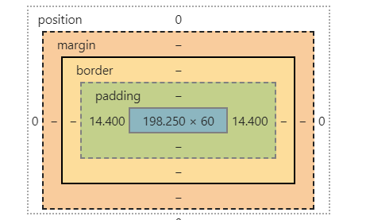

# HTML盒模型

 

在我们写代码时，当打开F12控制台查看HTML元素的详情时，我们就能看到这个东西。而我们要讨论的盒模型就包含在里面。

> W3C盒模型

W3C盒模型就是我们日常开发使用的盒模型，W3C盒模型包含了上面有颜色的部分，即margin、border、padding、content(width/height)

> IE盒模型

而IE盒模型的范围包括margin、content(padding、border、width/height)。所以，可以看出IE盒模型和W3C盒模型最大的区别就是content,IE盒模型的content是由padding、border、和内容组成的。

在IE5.5及更早期的浏览版本中，由于使用的规范版本较低。如果不在文档中加上\<!DOCTYPE html>,就会默认使用IE盒模型即怪异模式。而我们在开发的时候，当遇到元素由于padding或者boder宽度的原因被撑开了，我们也可以在相应元素的CSS中加上box-sizing: border-box; 来使用IE盒模型。
