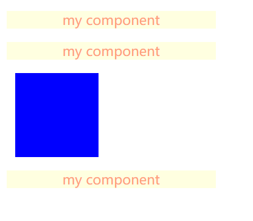
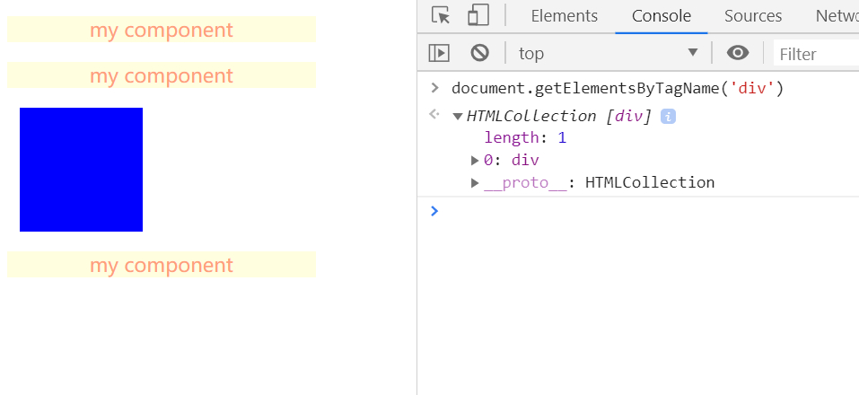
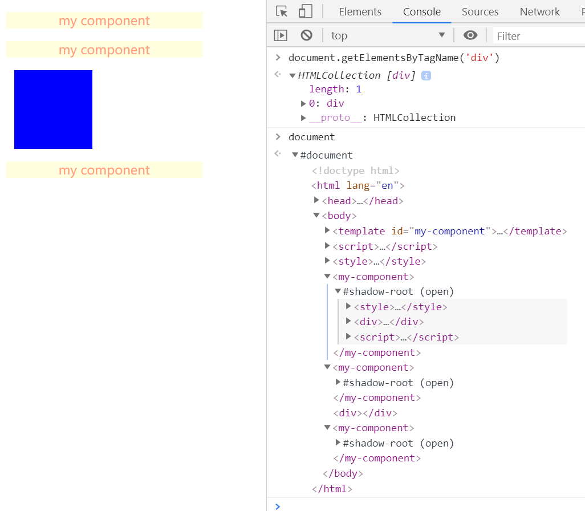

# WebComponent

在我们日常开发中如果遇到稍微复杂点的项目，就涉及到多人协作开发的问题，每个人负责的组件需要尽可能独立完成自己的功能，其组件的内部状态不能影响到别人的组件。但在我们编写网页代码时却常常遇到问题。

如下面的两段代码：
1. 
```
<style>
    p {
        background: lightyellow;
        color: lawngreen;
    }
</style>
<p>hello html</p>
```
2. 
```
<style>
    p {
        background: lightgreen;
        color: lightsalmon;
    }
</style>
<p>hello css</p>
```

这两段代码单独运行时是没有任何问题的，但是当将这两段代码打包混合之后，问题就会出现了，其中一个p标签的样式被覆盖了，这是由于 CSS 解析导致的错误，因为在生成布局树的时候，会在 CSSOM 中为布局树中的元素查找样式，所以有两个相同标签最终所显示出来的效果是一样的，渲染引擎是不能为它们分别单独设置样式的。所以我们有什么办法能对自己开发的代码进行封装呢？

WebComponent 的出现给了我们解决该问题的方法。

## 组件化开发

我们知道，出现上面的问题主要是因为我们编写代码时无意间受到或影响了外部代码。所以只要我们有办法对整块代码进行封装，即封装的CSS和html不会影响外部，就能解决这个问题了。而 WebComponent 的功能就是‘**将局部的 CSS 和 HTML 封装成一个组件**’。

而 WebComponent 其实是一套技术的组合，其中包含了 自定义元素(Custom elements)、影子元素(Shadow Dom)、HTML模板(HTML template)，可以参考MDN中的介绍 [WebComponent](https://developer.mozilla.org/zh-CN/docs/Web/Web_Components)

下面我们就来自己实现一个简单的组件:
```
 // 编写组件的 HTML模板(包含CSS、HTML、JS)
<template id="my-component">
    <style>
        p {
            background: lightyellow;
            color:lightsalmon;
        }
        div {
            background: lightgreen;
            width: 250px;
            border-radius: 10px;
            text-align: center;
        }
    </style>
    <div>
        <p>my component</p>
    </div>
    <script>
        function fn() {
            console.log('test component')
        }
    </script>
</template>

<script>
    /**
    * 该类负责将 HTML模板 挂载到 shadowDOM 上 
    */
    class MyComponent extends HTMLElement {
        constructor(params) {
            super()
            // 模板
            const content = document.querySelector('#my-component').content    
            // 创建影子节点 组件被封装成影子节点
            const shadowDOM = this.attachShadow({ mode: 'open' })
            shadowDOM.appendChild(content.cloneNode(true)) 
        }
    }
    customElements.define('my-component', MyComponent) // 定义组件
</script>
<style>
    div {
        background:blue;
        width: 100px;
        height: 100px;
        margin: 10px;
    }
</style>
    <my-component></my-component>
    <my-component></my-component>
    <div></div>
    <my-component></my-component>
```



从上图和代码我们可以了解到，在最下面的 style 中我们为 div标签添加了样式，但该样式并没有影响到 \<my-component> 组件中的 div 样式，也就成功的实现了封装的效果。

当我们在控制台输出 document.getElementsByTagName('div') 时，会发现只能找到一个 div (上图蓝色的)



当我们输出 doucument 对象查看时，会发现 \<my-component> 组件下会有一个 #shadow-root (open) 字样 这就是shadowDOM 的标志，里面包含的就是我们封装的组件。

Shadow DOM 允许将隐藏的 DOM 树附加到常规的 DOM 树中——它以 shadow root 节点为起始根节点，在这个根节点的下方，可以是任意元素，和普通的 DOM 元素一样。


