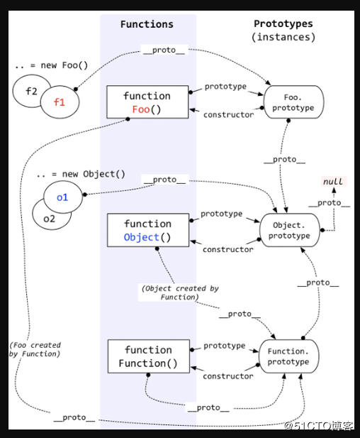

# JS原型链

在JS中我们怎么判断一个实例的原型是什么呢？instanceof操作符可能是我们首先会想到的，但是它又是通过什么方式查找得到该实例的原型呢？

```
var fn = new Foo()
function Foo(){ }
console.log(fn instanceof Foo) // true
console.log(fn instanceof Object) // true
```
如上面一段代码中，fn instanceof Foo/Object 返回的值都为true，这是为什么呢？可以先看下图：



我们先来了解一下 JS 中，原型和实例的关系：
高程三用这样一段话形容：**每个构造函数都有一个原型对象，原型对象都包含一个指向构造函数的指针，而实例都包含一个指向原型对象的内部指针。** 如果试图引用对象的某个属性,会首先在对象内部寻找该属性,直至找不到,然后才在该对象的原型里去找这个属性.

在回看上面的图我们就会发现，实例都有一个属性（\__proto__）指向相应构造函数的原型对象(xxx.prototype)，而原型对象中又有一个属性(xxx.protype.constructor)指向构造函数

```
var fn = new Foo()
function Foo(){ }
console.log(fn.__proto__ === Foo.prototype) // true
console.log(Foo.prototype.constructor === Foo) // true
```

从上面这段代码中的前两个输出结果可以得到，实例的 \__proto__（fn.\__proto__）属性是指向构造函数的原型对象(Foo.prototype)的，而原型对象(Foo.prptotype)的constructor属性指向构造函数(Foo)。而第三个输出结果为 true 是因为构造函数是函数 所以就相当于是 Function 的一个实例。

## Function 和 Object
```
console.log(Function.__proto__ === Function.prototype)
```
为什么结果为true?

我们可以从图和代码了解得到，Function 即函数的构造函数 中存在一个 \__proto属性指向自身的 prototype 属性。其实只要我们理解所有的构造函数都是函数,这就想得通了。所以 Function 即是构造函数也算是一个函数的实例。

而我们可以从开始的图看到原型链的尽头就是 Object.prototype -> Object.prototype.__proto -> null，即 Object.prototype 不是任何东西的实例  ( 虽然 typeof null 的输出为 'object'，即为一个引用类型值，但是它表示的是值为0的地址，且所有的null指向的地址都一样)

再来看下面的代码：
```
function Father() {
    this.methodFromFather = function() {
        console.log('methodFromFather')
    }
}

function Son() {
    this.methodFromSon = function() {
        console.log('methodFromSon')
    }
}
Son.prototype = new Father()
let son = new Son()
console.log(son)
son.methodFromFather() // methodFromFather
son.methodFromSon() // methodFromSon
console.log(son instanceof Father) // true
```
从上面代码我们能更清晰地了解原型链这个东西了，从代码可以看到，我们声明了两个构造函数，Father() 和 Son() 并且我们将 Father 的实例赋值给了 Son.prototype 相当于 Son.prototype.\__proto__ = Father.prototype 操作，而我们经过这一步骤之后就实现了最简单的继承了。我们可以看到，Son 的实例调用了 Father构造函数中的方法，而 son instanceof Father 输出也为 true，即Son 继承了 Father。

这就进一步地说明，对实例属性的查找，就是通过实例中的\__proto__指向的原型，再从该原型的 \__proto__ 指向的 原型这样一路查找的，instanceof 的原理也是如此，直到指向Object.prototype(Object.prototype.\__proto__ 为 null)为止

## JS中的继承

从上面我们初步了解JS的原型了，了解了怎么实现一个继承(原型链继承)。但是这种方式实现继承也是有问题的，比如：
```
function SuperType() {
    this.colors = ['red', 'blue', 'green']
}

function SubType() {
    
}
SubType.prototype = new SuperType()
var instance1 = new SubType()
instance1.colors[0] = 'white'
var instance2 = new SubType()
console.log(instance1.colors) //  ["white", "blue", "green"]
console.log(instance2.colors) //  ["white", "blue", "green"]
```

从代码的输出结果，可以知道，如果继承了包含引用类型的属性，则继承的实例都会共享该属性的值。

还有一个问题就是，在创建子类型的实例时，不能向超类型的构造函数中传递参数(即在SubType中不能向SuperType的构造函数传参)。

解决方法：

### 借用构造函数

```
function SuperType(name) {
    this.colors = ['red', 'blue', 'green']
    this.name = name || ''
}

function SubType(name) {
    SuperType.call(this, name)
}
var instance1 = new SubType('ziho')
instance1.colors[0] = 'white'
var instance2 = new SubType()
console.log(instance1) 
console.log(instance2)
```
利用call方法在新创建的对象上执行构造函数，这样好像就解决了那两个问题。但是还是存在缺陷：
+ 方法都需要在构造函数内部定义
+ 在父类中定义的一些方法对子类是不可见的

### 原型式继承

```
function object(o) {
    function F() {}
    F.prototype = o
    return new F()
}

var person = {
    name: 'test1',
    friends: [1, 2, 3]
}
var p1 = object(person)
p1.name = 'test2'
p1.friends.push(4)
var p2 = object(person)
p2.name = 'test3'
p2.friends.push(5)
console.log(person)
console.log(p1)
console.log(p2)
```
代码内部，创建了一个构造函数，然后将传入的值作为构造函数的原型，最后返回通过构造函数创建的实例。所以这种继承方式并没有创建严格意义上的构造函数，而是通过原有对象的基础上创建对象。

我感觉这只是及其简陋的一种继承方法，相当于直接使用了实例作为父类，而且也并没有解决子类共用继承引用属性值的问题。

Object.create() 方法在只使用一个参数的情况下，功能与上面代码中的object() 方法是相同的，而第二个参数就是给新建的对象添加属性，跟Object.definePrototype() 中第二个参数功能类似

### 寄生式继承

该模式是在原型式继承上做的改良
```
function object(o) {
    function F() {}
    F.prototype = o
    return new F()
}
function createObject(original) {
    var clone = object(original)
    clone.say = function(){
        console.log('hi')
    }
    return clone
}
```
该方式的实际运用如上面代码中的 createObject 方法，其实就是先通过原型式继承的方法创建一个实例，再在该实例上添加子类需要的方法，然后返回，所以就能在子类添加方法了。但是这种方式并不是最优的。

### 寄生组合式继承

在组合式继承中(通过在子类中调用父类构造函数并将构造函数的this指向新对象的模式)，会调用两次构造函数。而寄生组合式继承的原理就是通过寄生式继承来继承父类的原型，再讲结果指定给子类的原型。大致的实现如下：

```
function CreateObject(subType, superType){
    var prototype = object(superType.prototype) // 创建父类原型的副本
    prototype.constructor = subType // 将子类构造函数作为副本的构造函数
    subType.prototype = prototype // 将副本作为子类原型
}
```

因为从父类继承的属性和方法都是通过实例查找原型的方式查找的，所以 subType.prototype = prototype 就相当于继承了父类的属性，而prototype.constructor = subType就是为了可以在子类中定义自己的方法和属性。

### TypeScript 中的 extend

TS
```
class Father {
    _name: string
    constructor(name: string) {
        this._name = name
    }

    getName() {
        return this._name
    }

}

class Son extends Father {
    constructor(name: string) {
        super(name)
    }
}
```
编译后的JS
```
var __extends = (this && this.__extends) || (function () {
    var extendStatics = function (d, b) {
        extendStatics = Object.setPrototypeOf ||
            ({ __proto__: [] } instanceof Array && function (d, b) { d.__proto__ = b; }) ||
            function (d, b) { for (var p in b) if (b.hasOwnProperty(p)) d[p] = b[p]; };
        return extendStatics(d, b);
    };
    return function (d, b) {
        extendStatics(d, b);
        function __() { this.constructor = d; }
        d.prototype = b === null ? Object.create(b) : (__.prototype = b.prototype, new __());
    };
})();
var Father = /** @class */ (function () {
    function Father(name) {
        this._name = name;
    }
    Father.prototype.getName = function () {
        return this._name;
    };
    return Father;
}());
var Son = /** @class */ (function (_super) {
    __extends(Son, _super);
    function Son(name) {
        return _super.call(this, name) || this;
    }
    return Son;
}(Father));
```
主要方法就是 extendStatics 

 + Object.setPrototypeOf(obj, prototype)
    + obj
        要设置其原型的对象.
    + prototype
        该对象的新原型(一个对象 或 null).

```
(
    { __proto__: [] } instanceof Array
    && function (d, b) { d.__proto__ = b; }
) 
```
这一段代码是用来检测浏览器是否支持__proto__属性，支持就执行 function (d, b) { d.\__proto__ = b; }, 即子类构造函数的__proto__属性指向父类的构造函数（功能其实跟 Object.setPrototypeOf一样）

```
for (var p in b) {
    if (b.hasOwnProperty(p)) {
        d[p] = b[p]; 
    }
}
```
相当于将 父类b 中的属性拷贝到 子类d 中

```
function (d, b) {
    extendStatics(d, b);
    function __() { this.constructor = d; }
    d.prototype = b === null ? Object.create(b) : (__.prototype = b.prototype, new __());
};
```
function __() { this.constructor = d; } 将原型对象的构造函数指向 Sub(子类)

b === null ? Object.create(b): 即表示 Sub 继承 null 即返回一个没有任何属性和方法的对象

\__.prototype = b.prototype, new \__(),将__函数的prototype指向 Super 的 prototype, 然后执行 new __() 


我将其拆分了出来

```
function Sup(name) { // 父类构造函数
    this.name = name
}

Sup.prototype.say = function() { // 父类中的方法
    console.log(this.name)
}

function Sub(name) {
    Sup.call(this, name) // 在子类中调用父类的构造函数并使用call方法在构造函数内部将this指向新对象
}

Sub.__proto__ = Sup // 子类构造函数的 __proto__ 指向 父类构造函数 

function __() { // 创建一个临时构造函数
    this.constructor = Sub // 该实例中的constructor 指向 Sub 实现 Sub.prototype.constructor -> Sub
}

__.prototype = Sup.prototype // 相当于 使用new _() 创建的实例 实现原型链继承Sup

Sub.prototype = new __() // 子类的原型为 临时构造函数的实例 即Sub.prototype = _.proto__ 而 
```
当你仔细阅读这段代码时你会发现其中都将原型链需要的东西都实现了，**每个构造函数都有一个原型对象，原型对象都包含一个指向构造函数的指针(__()中的constructor)，而实例都包含一个指向原型对象的内部指针。** 子类的对象原型(Sub.prototype)是通过 new \__() 创建的。
