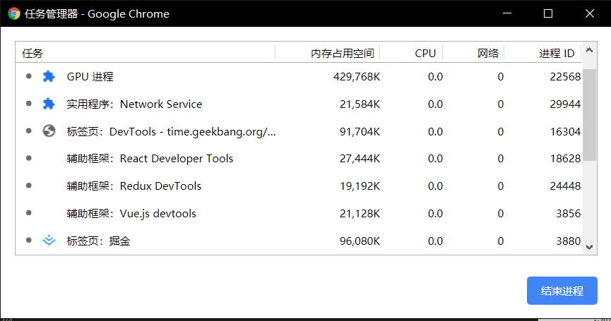
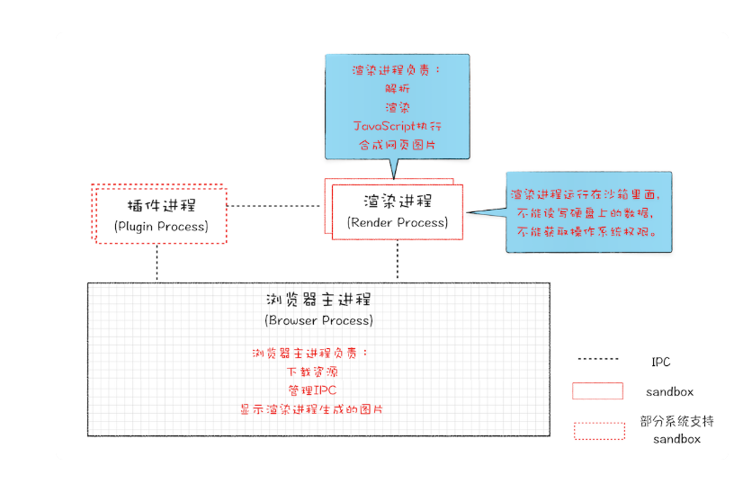
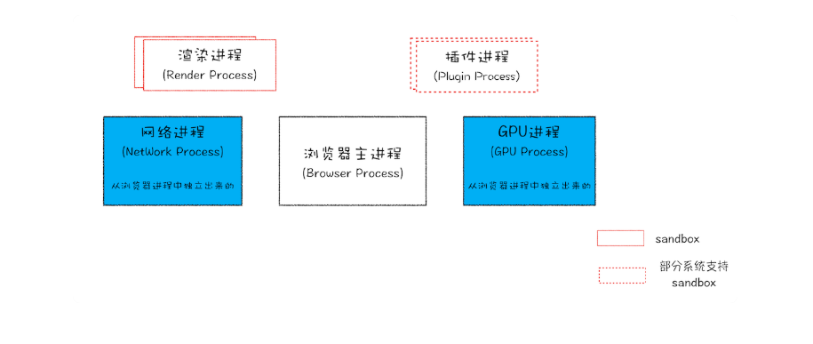
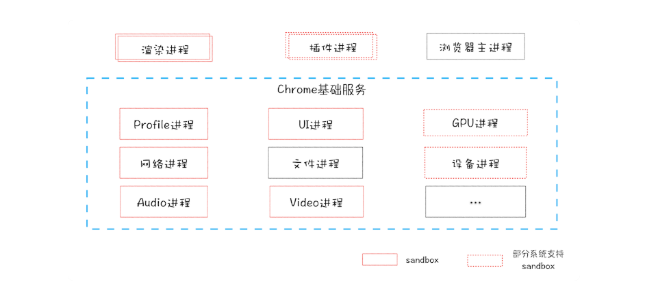

# 浏览器工作原理

作为前端工程师，浏览器就相当于JAVA中的JVM，即JS就是跑在浏览器上的，所以我们也必须对浏览器的工作原理有所了解

## 浏览器中的进程

如果你使用的是chrome浏览器，你可以打开chrome的任务管理器(更多工具>任务管理器)查看浏览器中的进程

在没了解前，我的认知都是浏览器是单进程多线程的，每个页面都是由单独的线程来渲染。但是后面细想，如果当某一线程阻塞了，那当前的进程不就不能往前推进了吗。所以当前的浏览器是多进程的(根域名相同的页面会放在同一个渲染进程中处理)，所以只要根域名不同的页面互相不会影响，而且在同一进程中的页面执行环境都是相同的(线程可以共享进程中的资源)。

### 老版的浏览器
在老版的浏览器用的就是单进程的方式运行的，在开始阶段是每个页面开一个独立窗口(单进程单线程，因为像session这样的数据在不同线程是很难访问的)，即所有的功能模块都运行在一个进程中，所以就会产生很多问题。

+ 不稳定
    在早期的浏览器中，都是借助插件来实现的视频、web游戏等功能的。但在浏览器中的插件都是及其不稳定的，所以当某一个插件崩溃了，就会导致整个浏览器崩溃。
+ 不流畅
    当老版浏览器在运行时，如果运行某些复杂页面时，会存在内存泄漏问题，即当页面关闭后，线程虽然被回收，但在进程中的部分数据仍然存在，导致浏览器的内存占用越来越高变得越来越卡。

+ 不安全
    因为渲染的任务(JS代码)与读写任务共用一个进程，所以就导致了老版的浏览器会存在问题(因为你不可能限制所有线程的读写，这样你就不能进行图片的下载上传了)

### 新版浏览器

因为老版浏览器的诸多问题，新的浏览器架构诞生了。(早期的chrome架构)

可以看到，早期的chrome浏览器的很多功能都有相应的进程运行。这样就能很轻松的解决了老版浏览器的三个问题。

+ 解决不稳定
    由于不同功能模块运行在不同进程，所以某进程的崩溃不会影响到其他进程。
+ 解决不流畅
    进程一旦释放系统就会回收相应的内存，所以就内存泄漏就被解决了。

+ 不安全
    chrome将插件进程和渲染进程(JS代码)用安全沙箱封了起来，相当系统
    给进程上锁了。限制进程对系统文件的读写，所以问题就解决了。

#### 目前的架构

看以看出目前的浏览器包括：多个渲染进程、多个插件进程、一个网络进程、一个GPU进程、一个浏览器主进程

所以要运行浏览器最少需要4个进程：一个渲染进程、一个网络进程、一个GPU进程、一个主进程

但是相应的问题也出现了：
+ 更高的资源占用
    因为每个功能模块都会有独立的进程，就以为着会占用更多的系统资源
+ 更复杂的体系
    浏览器各模块之间耦合性高、扩展性差等问题，会导致现在的架构已经很难适应新的需求了。

#### 未来的架构
为了解决这些问题，在 2016 年，Chrome 官方团队使用“面向服务的架构”（Services Oriented Architecture，简称 SOA）的思想设计了新的 Chrome 架构。Chrome 整体架构会朝向现代操作系统所采用的“面向服务的架构” 方向发展，原来的各种模块会被重构成独立的服务（Service），每个服务（Service）都可以在独立的进程中运行，访问服务（Service）必须使用定义好的接口，通过 IPC 来通信，从而构建一个更内聚、松耦合、易于维护和扩展的系统，更好实现 Chrome 简单、稳定、高速、安全的目标。

Chrome 最终要把 UI、数据库、文件、设备、网络等模块重构为基础服务，类似操作系统底层服务。

