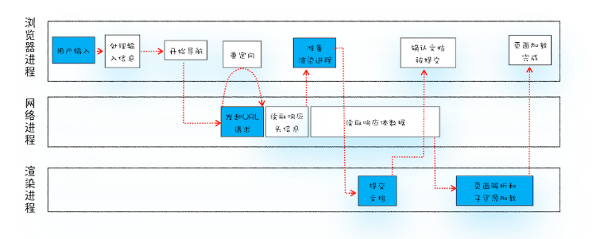
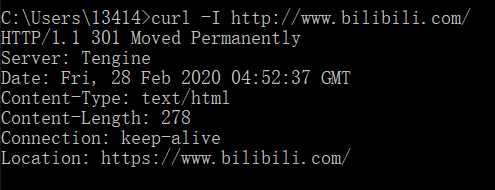
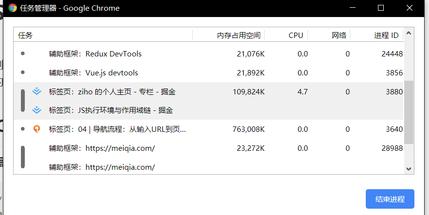
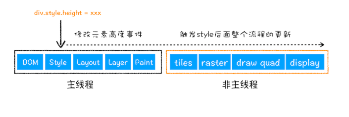
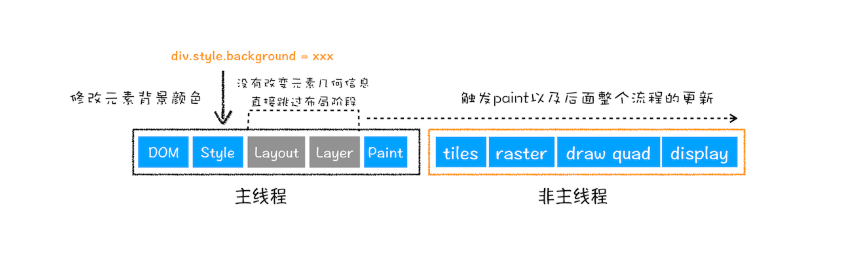
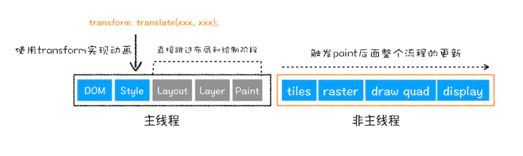

# 从输入URL到页面展示，中间发生了什么？



大致为一下几个步骤：

## 用户输入
+ 如果输入的是搜索内容，地址栏会使用浏览器默认的搜索引擎来合成带搜索的URL
+ 如果输入的内容符合URL规则，地址栏会根据规则以及相应的协议，合成完整的URL
## URL请求
+ 浏览器进程会通过进程间通信(IPC)将URL请求发送至网络进程，网络进程接收到URL请求后会发起真正的URL请求 
+ 首先网络进程会先查找浏览器本地是否存在相关的缓存数据，如果存在，直接返回资源给浏览器进程。
+ 不存在相关缓存，进入网络请求环节。第一步就是先进行DNS解析，从DNS获取对应的服务器IP地址，如果请求是HTTPS协议的，还需要建立TLS链接。
+ 当浏览器与服务端建立了TCP连接后，浏览器端会构建请求行、请求头等信息，并把和该域名相关的 Cookie 等数据附加到请求头中，然后向服务器发送构建的请求信息。
+ 服务端接收到请求信息，根据请求信息生成响应的数据并返回。当网络进程接收到响应数据后，就开始解析响应头的信息。
+ 解析响应头
    + 重定向
    当网络进程接收到响应数据并开始解析响应头信息时，发现返回的状态码是301或者302时，说明服务器需要浏览器重定向到其他的URL中，此时浏览器就会重定向到响应头中Location字段的地址，然后重新发起URL请求。
    如在控制台输入:
        ```
        curl -I http://www.bilibili.com/
        ```
        就能看到返回的响应头信息
        

        HTTP/1.1 ==301== 这里的301就是HTTP的状态码，当状态码为**200**时，表示浏览器可以继续处理该请求。

    + 响应类型的处理
    因为响应的数据可能不是HTML模板而是一个安装包时，我们怎么对这些数据进行区分呢？其实就是Content-Type字段。**Content-Type 是 HTTP 头中一个非常重要的字段**， 它告诉浏览器服务器返回的响应体数据是什么类型，然后浏览器会根据 Content-Type 的值来决定如何显示响应体的内容
    比如：
        
        在这个图中 Content-Tye: ==text/html== ，就表示返回的数据类型为HTML格式，如果显示的是==application/octet-stream==即流文件，则会进行下载，而不是想HTML格式一样由浏览器进行渲染。

## 准备渲染进程
默认情况下，浏览器会给每一个页面分配一个渲染进程，就是说没打开一个新的页面浏览器就会分配一个新的渲染进程和相关的资源。但是如果当打开的页面根域名相同时，浏览器会将相同根域名的页面交给同一个渲染进程进行渲染。
如下图：

这里我打开了两个[掘金](https://juejin.im/timeline)的页面,但浏览器只分配了一个ID为3880的进程处理。
所以当打开的页面，与之前的页面为同一根域名，且使用相同协议(即同源)的，浏览器会使用同一个进程处理这些页面。

## 提交文档

所谓提交文档，就是指浏览器进程将网络进程接收到的 HTML 数据提交给渲染进程，具体流程是这样的：
+ 首先当浏览器进程接收到网络进程的响应头数据之后，便向渲染进程发起“提交文档”的消息；
+渲染进程接收到“提交文档”的消息后，会和网络进程建立传输数据的“管道”；
+ 等文档数据传输完成之后，渲染进程会返回“确认提交”的消息给浏览器进程；
+ 浏览器进程在收到“确认提交”的消息后，会更新浏览器界面状态，包括了安全状态、地址栏的 URL、前进后退的历史状态，并更新 Web 页面。 

即当浏览器的前进后退标准、URL地址栏、页面安全状态等(即导航流程)完成后，就到渲染阶段了。（其实就是打开一个新页面时，前一个页面还在的那段时间）

## 渲染阶段

+ 首先渲染引擎会先将HTML代码解析成浏览器可以理解的**DOM树**(类似JS中的doucument对象)

+ 生成DOM树后，根据CSS样式表，生成与DOM树对应的所有节点的样式(类似JS中document.**styleSheets**对象)

+ 根据DOM数与样式树生成**布局树**

+ 布局计算，根据布局树计算每个节点在浏览器页面中**相应的位置/坐标**

+ 对布局树进行**分层**，并生成**分层树**。

+ 为每个图层生成**绘制列表**，并将其提交到合成线程。

+ 合成线程将图层分成**图块**，并在**光栅化线程池**中将图块转换成位图。

+ 合成线程发送绘制图块命令 **DrawQuad** 给浏览器进程。

+ 浏览器进程根据 DrawQuad 消息**生成页面**，并**显示**到显示器上。

## 相关概念

+ “重排”
    
    例如改变元素的宽度、高度等，那么浏览器会触发重新布局，解析之后的一系列子阶段，这个过程就叫重排。无疑，**重排需要更新完整的渲染流水线，所以开销也是最大的**。    
+ “重绘”
    
    比如通过 JavaScript 更改某些元素的背景颜色，因为并没有引起几何位置的变换，所以就直接进入了绘制阶段，然后执行之后的一系列子阶段，这个过程就叫重绘。相较于重排操作，**重绘省去了布局和分层阶段，所以执行效率会比重排操作要高一些**。
+ “合成”
    
    我们使用了 CSS 的 transform 来实现动画效果，这可以避开重排和重绘阶段，直接在非主线程上执行合成动画操作。这样的效率是最高的，因为是在非主线程上合成，并没有占用主线程的资源，另外也避开了布局和绘制两个子阶段，所以**相对于重绘和重排，合成能大大提升绘制效率**。

怎么防止多余的重排、重绘呢？

+ 使用class来操作样式，批量修改样式，避免频繁的操作style
+ 避免使用table布局，因为table布局对渲染引擎不友好，且容易造成整个布局的"重排"
+ 批量操作dom,比如使用文档碎片createDocumentFragment,或者类似vue和react等有虚拟节点VNode的框架
+ 对动画进行“节流”的操作
+ 对dom的读写要分离
+ 用transform位移来代替操作left/right/top/bottom

