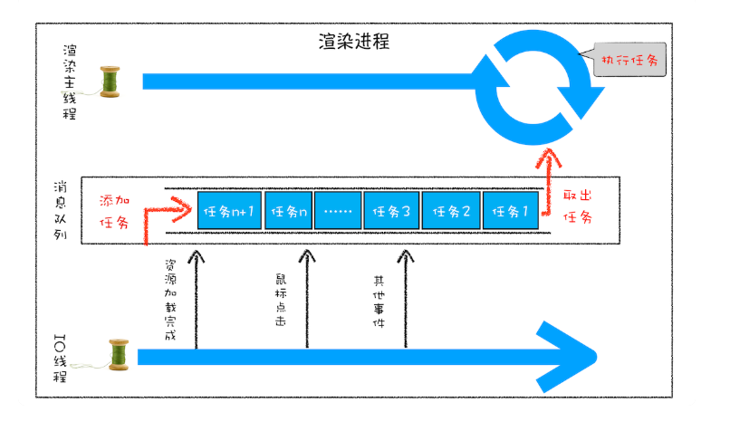
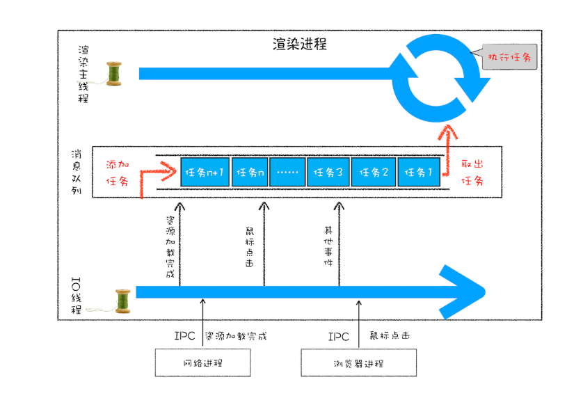

# evenloop 宏任务和微任务

我们需要知道**每个渲染进程都有一个主线程**，并且主线程非常繁忙，既要处理 DOM，又要计算样式，还要处理布局，同时还需要处理 JavaScript 任务以及各种输入事件。要让这么多不同类型的任务在主线程中有条不紊地执行，这就需要一个调度机制来完成安排按怎样的顺序来执行这些任务。

我们可以先从上图来初步了解一下JS的这个调度机制。首先JS利用一个消息队列来存放将要执行的事件。渲染进程的主线程从队首取出任务执行，而IO线程则在队尾添加需要执行的事件。就是这样的队列调度样JS代码能按顺序地执行下去。

## 处理其他进程发送的任务

从图中可以看出，**渲染进程专门有一个 IO 线程用来接收其他进程传进来的消息**，接收到消息之后，会将这些消息组装成任务发送给渲染主线程，后续的步骤就和前面讲解的“处理其他线程发送的任务”一样了，这里就不再重复了。

## 消息队列中都有什么任务?

我们知道了主线程怎么接收外部事件，那消息队列中都有什么任务？根据部分文档，消息队列中包含的事件一般有输入事件（鼠标滚动、点击、移动）、微任务、文件读写、WebSocket、JavaScript 定时器等等。

除此之外，消息队列中还包含了很多与页面相关的事件，如 JavaScript 执行、解析 DOM、样式计算、布局计算、CSS 动画等。

以上这些事件都是在主线程中执行的，所以在编写 Web 应用时，你还需要衡量这些事件所占用的时长，并想办法解决单个任务占用主线程过久的问题。

## 怎么处理高优先级任务?

比如一个典型的场景是监控 DOM 节点的变化情况（节点的插入、修改、删除等动态变化），然后根据这些变化来处理相应的业务逻辑。一个通用的设计的是，利用 JavaScript 设计一套监听接口，当变化发生时，渲染引擎同步调用这些接口，这是一个典型的观察者模式。

不过这个模式有个问题，因为 DOM 变化非常频繁，如果每次发生变化的时候，都直接调用相应的 JavaScript 接口，那么这个当前的任务执行时间会被拉长，从而导致执行效率的下降。

如果将这些 DOM 变化做成异步的消息事件，添加到消息队列的尾部，那么又会影响到监控的实时性，因为在添加到消息队列的过程中，可能前面就有很多任务在排队了。

这也就是说，如果 DOM 发生变化，采用同步通知的方式，会影响当前任务的**执行效率**；如果采用异步方式，又会影响到监控的**实时性**。

针对这种情况，微任务就应用而生了，下面我们来看看微任务是如何权衡效率和实时性的。

通常我们把消息队列中的任务称为宏任务，**每个宏任务中都包含了一个微任务队列**，在执行宏任务的过程中，如果 DOM 有变化，那么就会将该变化添加到微任务列表中，这样就不会影响到宏任务的继续执行，因此也就解决了执行效率的问题。

等宏任务中的主要功能都直接完成之后，这时候，渲染引擎并不着急去执行下一个宏任务，而是执行当前宏任务中的微任务，因为 DOM 变化的事件都保存在这些微任务队列中，这样也就解决了实时性问题。

## 宏任务

前面我们已经介绍过了，页面中的大部分任务都是在主线程上执行的，这些任务包括了：
+ 渲染事件（如解析 DOM、计算布局、绘制）；
+ 用户交互事件（如鼠标点击、滚动页面、放大缩小等）；
+ JavaScript 脚本执行事件；
+ 网络请求完成、文件读写完成事件。

为了协调这些任务有条不紊地在主线程上执行，页面进程引入了消息队列和事件循环机制，渲染进程内部会维护多个消息队列，比如延迟执行队列和普通的消息队列。然后主线程采用一个 for 循环，不断地从这些任务队列中取出任务并执行任务。我们把这些消息队列中的任务称为**宏任务**。

## 微任务

从目前的情况来看，微任务已经被广泛地应用，基于微任务的技术有 MutationObserver、Promise 以及以 Promise 为基础开发出来的很多其他的技术。

**微任务就是一个需要异步执行的函数，执行时机是在主函数执行结束之后、当前宏任务结束之前。**

我们知道当 JavaScript 执行一段脚本的时候，V8 会为其创建一个全局执行上下文，在创建全局执行上下文的同时，V8 引擎也会在内部创建一个**微任务队列**。顾名思义，这个微任务队列就是用来存放微任务的，因为在当前宏任务执行的过程中，有时候会产生多个微任务，这时候就需要使用这个微任务队列来保存这些微任务了。不过这个微任务队列是给 V8 引擎内部使用的，所以你是无法通过 JavaScript 直接访问的。

第一种方式是使用 MutationObserver 监控某个 DOM 节点，然后再通过 JavaScript 来修改这个节点，或者为这个节点添加、删除部分子节点，当 DOM 节点发生变化时，就会产生 DOM 变化记录的微任务。

第二种方式是使用 Promise，当调用 Promise.resolve() 或者 Promise.reject() 的时候，也会产生微任务。

